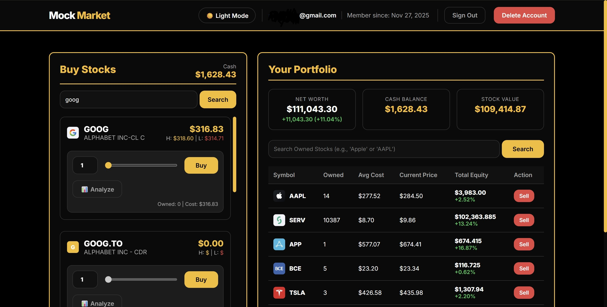

# Mock Market 📈

**A Full-Stack Investment Simulation Platform featuring Hybrid AI Analysis**

Mock Market is a trading simulation application that bridges the gap between traditional quantitative finance and modern Generative AI. It utilizes a high-performance **C++ engine** for technical indicator calculations and **Google Gemini** for qualitative market sentiment analysis, providing users with a comprehensive "Buy/Sell/Hold" decision for any given stock.




## 🚀 Key Features

- **Risk-Free Paper Trading**
  Users sign in securely via **Google** and instantly receive a **$100,000** virtual portfolio to practice trading strategies without financial risk.

- **Real-Time Market Data**
  Fetches live pricing and historical data using **Yahoo Finance** and **Finnhub** APIs.

- **Hybrid Intelligence Engine**
  - **Quantitative**: A dedicated C++ microservice calculates complex technical indicators (RSI, SMA, Bollinger Bands) in real-time.
  - **Qualitative**: Google Gemini (GenAI) acts as a "Portfolio Manager," synthesizing news headlines with the C++ hard math to make human-like trading decisions.

- **AI-Powered Insights**
  Returns clear textual analysis with a structured **Buy / Sell / Hold** signal and reasoning.

- **Microservices Architecture**
  Fully containerized using Docker and Docker Compose.

## 🛠 Architecture Overview

The application is split into three distinct services communicating via HTTP and TCP sockets:

1. **Frontend (React)** – User interaction, portfolio management, secure authentication via **Firebase (Google Sign-In)**.
2. **Backend (Node.js/Express)** – Orchestrator: fetches data, talks to C++ engine, feeds results + news into Gemini.
3. **CPP-Algos (C++)** – High-performance TCP server for technical indicator calculations.


## 📂 Project Structure

```text
mock-market/
├── backend/          # Node.js Express Server (API & Orchestration)
├── cpp-algos/        # C++ Quantitative Analysis Engine
├── frontend/         # React Client Application
├── docker-compose.yml
└── README.md
```

## ⚙️ Prerequisites

* **Node.js** (v16 or higher)
* **C++ Compiler** (MinGW for Windows or GCC/Clang for Linux/macOS)
* **Docker Desktop** (recommended for easy deployment)
* **API Keys:**
    * Finnhub API Key → `finnhub.io`
    * Google Gemini API Key → `Google AI Studio`

## 🔧 Installation & Setup

### Method 1: Docker (Recommended)

> **Note:** The current C++ code uses `winsock2.h`. For Docker (Linux containers), refactor socket code to standard BSD sockets (`<sys/socket.h>`, `<netinet/in.h>`).

1. **Clone the repository:**
   ```bash
   git clone [https://github.com/yourusername/mock-market.git](https://github.com/yourusername/mock-market.git)
   cd mock-market
   ```

2. **Create `.env` in the `backend/` directory:**
   ```env
   PORT=5000
   FINNHUB_API_KEY=your_finnhub_key_here
   GEMINI_API_KEY=your_gemini_key_here
   ```

3. **Build and run:**
   ```bash
   docker-compose up --build
   ```
   * Frontend → `http://localhost:80`
   * Backend → `http://localhost:5000`

### Method 2: Manual Setup (Local Development – Windows)

1. **Start the C++ Engine**
   ```bash
   cd cpp-algos
   g++ src/main.cpp -o algo_service.exe -lws2_32 -static
   ./algo_service.exe
   ```
   *→ Listens on port 8080*

2. **Start the Backend**
   ```bash
   cd backend
   npm install
   # Make sure .env exists with your keys
   node server.js
   ```
   *→ Listens on port 5000*

3. **Start the Frontend**
   ```bash
   cd frontend
   npm install
   npm start
   ```
   *→ Opens at http://localhost:3000*

## 💡 How It Works – The "Signal" Endpoint

When a user searches for a stock (e.g., AAPL):

1. **Data Fetch** – Backend pulls last 60 days of price data (Yahoo Finance) + recent news (Finnhub).
2. **Quant Analysis** – Price array sent to C++ engine (TCP port 8080).
3. **Math Calculation** – C++ returns RSI, SMA, Bollinger Bands, etc.
4. **AI Synthesis** – Backend sends technical string + news headlines to Google Gemini.
5. **Decision** – Gemini returns structured JSON:
   ```json
   { 
     "signal": "BUY", 
     "confidence": 0.82, 
     "reasoning": "Strong upward momentum..." 
   }
   ```

## 🚧 Cross-Platform Note

Current `cpp-algos/src/main.cpp` uses `<winsock2.h>` → **Windows-only**.
* To run inside Docker (Linux): replace with standard POSIX sockets.
* Local Windows development works out-of-the-box.

## 🤝 Contributing

Contributions are welcome! Feel free to open issues or submit Pull Requests.

## 📄 License

This project is licensed under the ISC License – see the LICENSE file for details.
